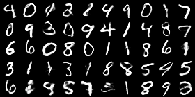

# CPPN-WGAN

Generate images with CPPNs and GANs.

See the CPPN+GAN blog post here, and then the WGAN variation here.
Vanilla CPPN/CPPN-GAN repo is here, though the CPPN-GAN does not quite work properly (but it does generate very interesting pictures).  

### Working with datasets (CIFAR10 and CASIA)

**CIFAR-10**: Download CIFAR-10 (Python version) at https://www.cs.toronto.edu/~kriz/cifar.html and place files into 'cifar-10-batches-py/'

**CASIA**: CASIA is a bit cumbersome to use. Currently 'tflib/casia.py' create a custom PyTorch dataloader to download the data, and then transform them into squares (since the raw data comes in various dimensions). The file makes use of the pycasia library. CASIA will automatically download; however the file may take a long time due to being hosted on Chinese servers. After the file is downloaded 'pycasia.load_dataset()' also takes forever to load all of the 'competition-gnt' file. The whole file is broken up into ~60 chunks, so I recommend first taking one chunk and loading that (move all the other files away from the data folder temporarily), before trying the entire dataset, to save time.

### Training the models

You can train by running e.g. 'python gan_cppn_cifar10.py'. Models take a few hours to train even on a GPU. Repo comes with pre-trained models of the generator.

### Generating Images

Run 'Interpolator.py' to generate images and gifs. In the main method you can edit the dimensions and samples you wish to create.

### Examples

Trained Samples:

### Special Thanks
Many thanks to @caogang for their WGAN-GP implementation which I heavily relied on for my code.
